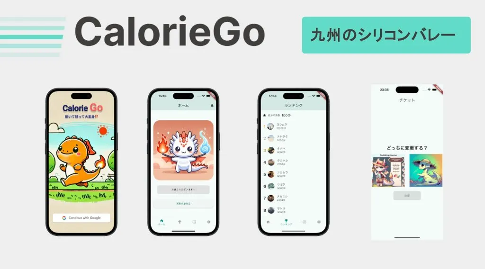

# [制作物](https://portfolio.you22fy.dev/works/)

| サムネイル                                                                                                                                   | プロジェクト                                                                                  | 使用技術                                    |
| -------------------------------------------------------------------------------------------------------------------------------------------- | --------------------------------------------------------------------------------------------- | ------------------------------------------- |
|                   | [Food Quest](https://portfolio.you22fy.dev/works/food_quest/)                                 | Unity, Go, Google Cloud, Gemini, PostgreSQL |
|  | [ギラトレ！](https://portfolio.you22fy.dev/works/gira_train/)                                 | Flutter, Go, Firebase                       |
|                     | [AI のとも](https://portfolio.you22fy.dev/works/ai_friends/)                                  | Flutter, Supabase,                          |
|                   | [Calorie Go](https://portfolio.you22fy.dev/works/calorie_go/)                                 | Serverpod(Flutter), ChatGPT                 |
|             | [Couple Canvas](https://portfolio.you22fy.dev/works/couple_canvas/)                           | Next.js, FastAPI, MySQL                     |
|           | [Copy URL as MD](https://portfolio.you22fy.dev/works/copy_url_as_md/)                         | TypeScript, Chrome Extension                |
|           | [Yumemi Flutter コーディングテスト](https://portfolio.you22fy.dev/works/yumemi_flutter_2024/) | Flutter                                     |
|                    | [Matchsite](https://portfolio.you22fy.dev/works/matchisite/)                                  | Ruby on Rails                               |

# 技術スタック

- プログラミング言語: Dart(Flutter) > Python > Go > TypeScript
- データベース: PostgreSQL, MySQL
- 資格: 情報セキュリティマネジメント試験, 基本情報技術者試験, 応用情報技術者試験
